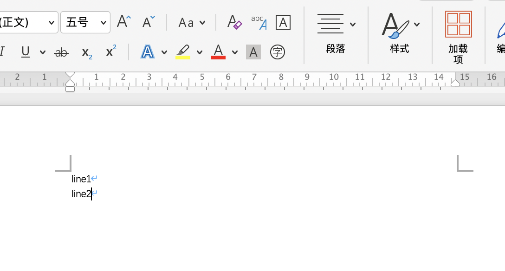
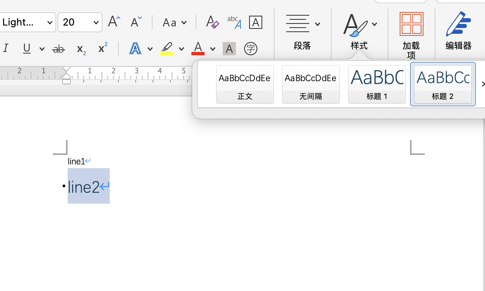
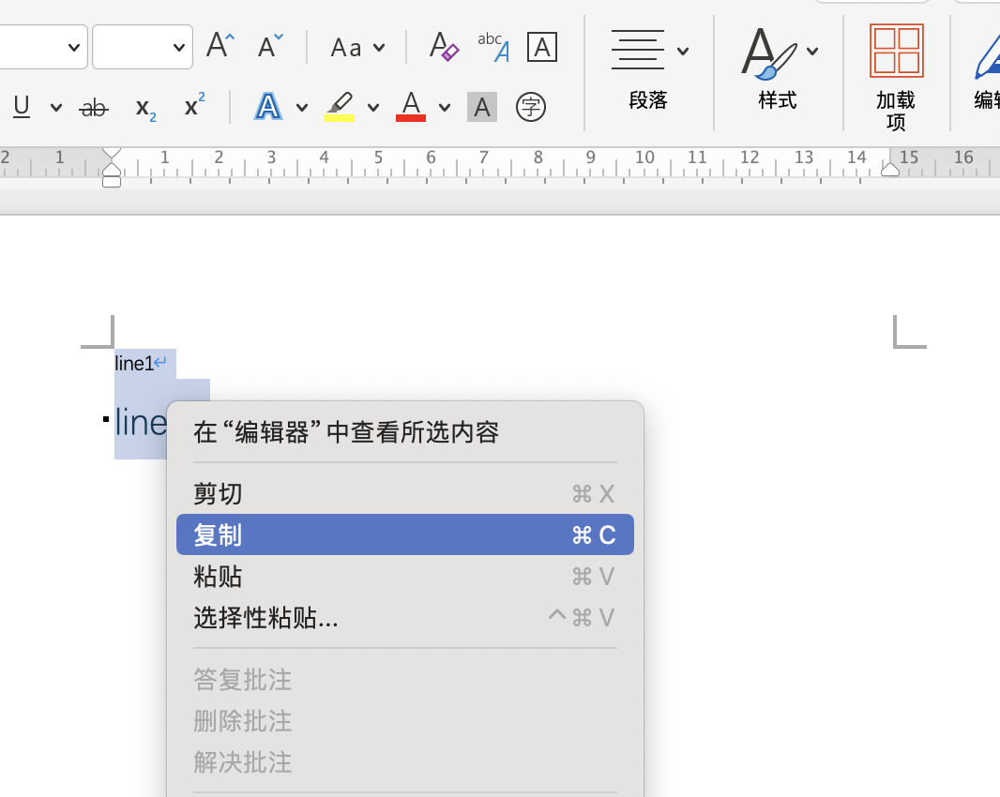
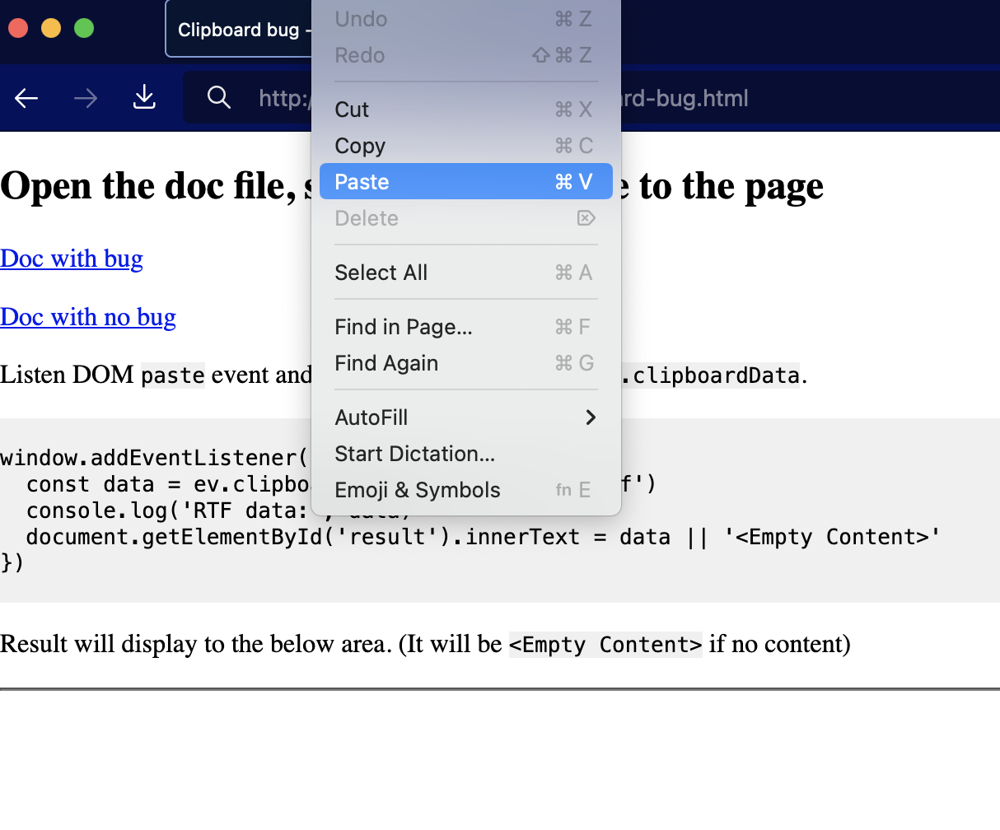
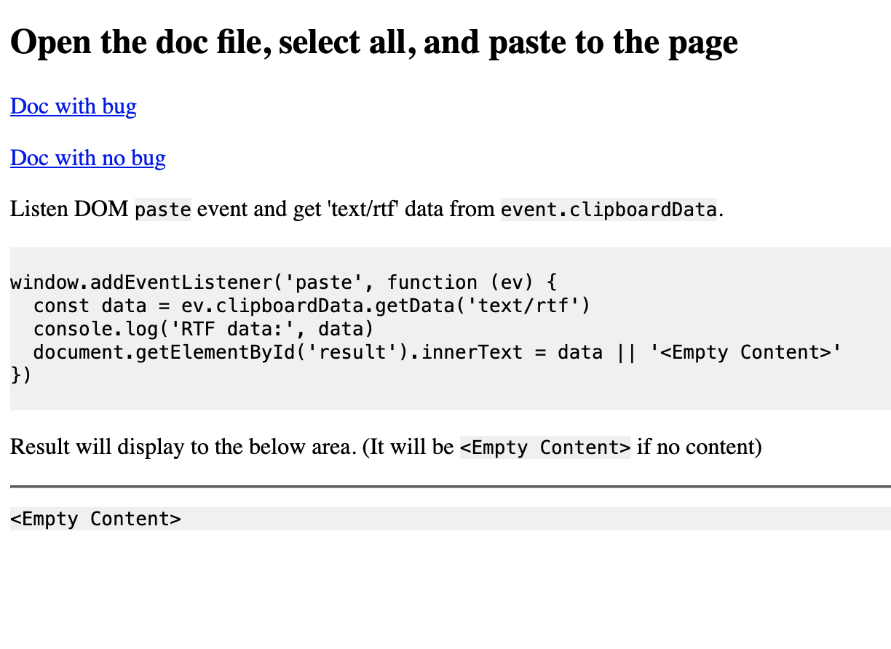

# `ClipboardData.getData('text/rtf')` bug

## Introduction

Paste selection from Office Word to web page, and JS `ClipboardEvent` will be triggered. If the selection contains "Heading" styles, like "Heading 1", "Heading 2", etc, `ClipboardEvent` rtf data will be empty.

## Issues

Firefox: [Bugzilaa](https://bugzilla.mozilla.org/show_bug.cgi?id=1887849)

Chrome: [Chromium issues](https://issues.chromium.org/issues/331316067)

## Reproduce

### Step1

Create Word document and type line1 and line2.

### Step2

Apply line2 with 'Heading 1' style.

### Step3

Copy all docuemnt content.

### Step4

Paste to [the demo page](https://zunsthy.github.io/problem-collection/clipboard-rtf-bug-demo).

## Result

It print "Empty Content", but expect RTF text.

