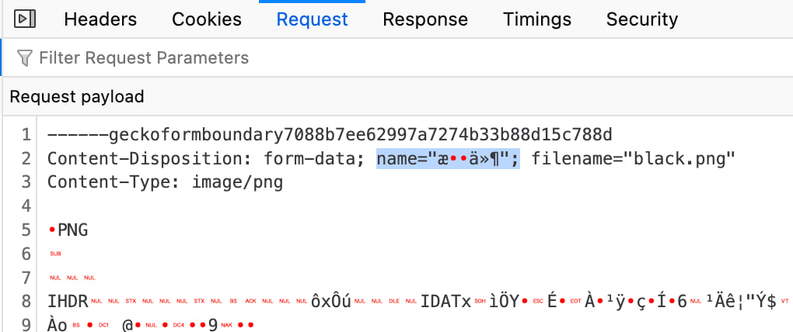
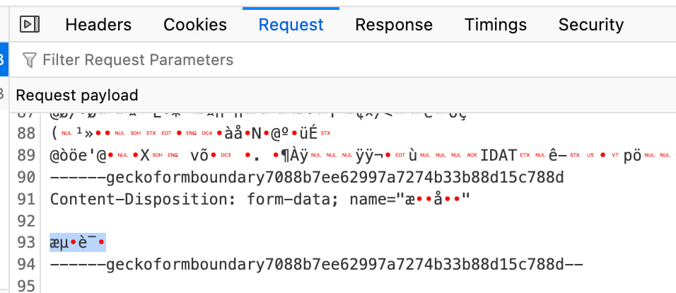
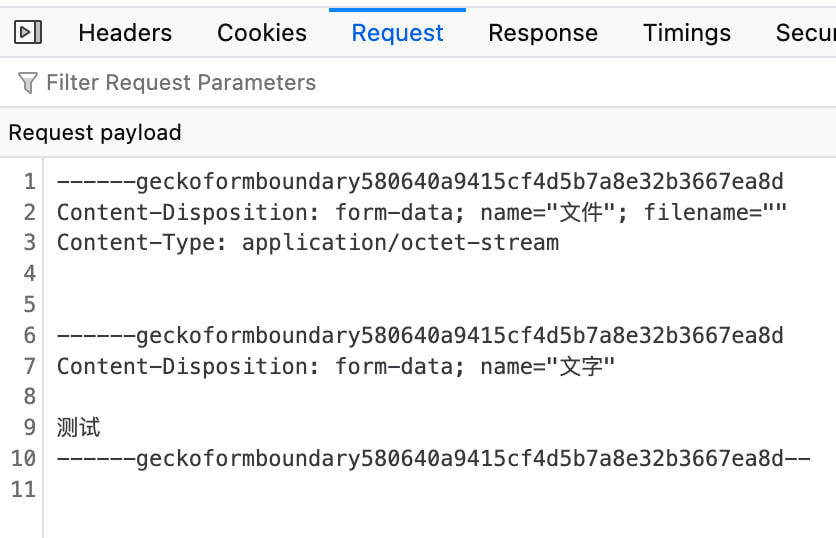

# Devtools Network Panel decode `FormData` incorrectly

## Introduction

Decode FormData payload with wrong encoding in devtools network panel.

## Issues

Firefox: [Bugzilaa](https://bugzilla.mozilla.org/show_bug.cgi?id=2034306)

## Reproduce

Create a form with file. Select file and fill some name or field with CJK charactors. Submit it.

Or open [the page](https://zunsthy.github.io/problem-collection/devtools-network-panel-decode-incorrect-for-formdata) to try.

Firefox:

If submit data has no file, encoding recognition is correct.

