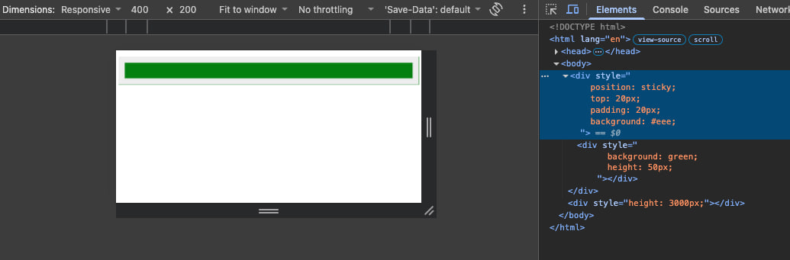
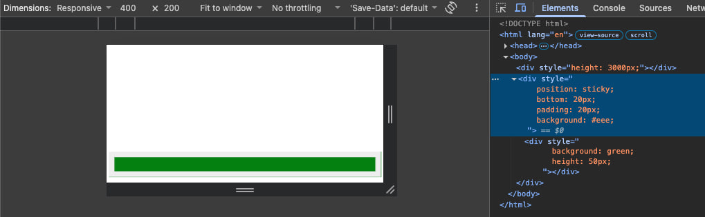

# Wrong Border Around Sticky Element In Chrome Responsive View

## Introduction

Wrong border with the same color as child element's background appearances around a sticky element. The sticky element has background and padding size is smaller than the child element height. This issue only occurs on Chrome for macOS.

## Issue

Chrome: [Chromium issue](https://issues.chromium.org/issues/561960451)

## Reproduce

Create a html and open it in chrome.

```html
<!DOCTYPE html>
<html lang="en">
<head>
  <meta charset="UTF-8">
  <title></title>
</head>
<body>
  <div style="position: sticky; top: 20px; padding: 20px; background: #eee;">
    <div style="background: green; height: 50px;"></div>
  </div>
  <div style="height: 3000px;"></div>
</body>
</html>
```

Or click to open [the page](https://zunsthy.github.io/problem-collection/wrong-border-around-sticky-element-in-chrome-responsive-mode/).

Open Chrome devtools panel and open device view mode.



The same issue when sticky bottom.


